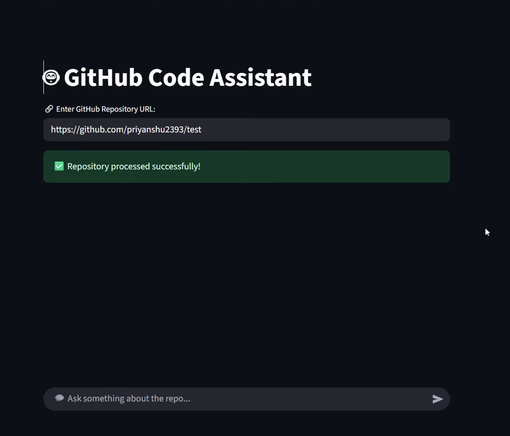
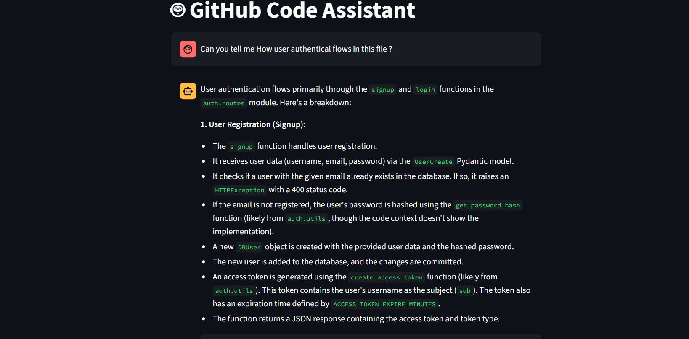
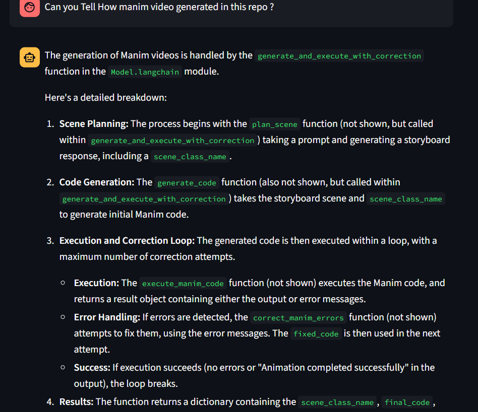

# GitLit 🔍🧠

**GitLit** is an AI-powered developer tool that helps you deeply understand, document, and interact with any GitHub repository. It features a natural-language codebase assistant and an automated README generator—all powered by Large Language Models (LLMs), vector embeddings, and knowledge graph technologies.

---

## 🚀 Features

- 🧠 **Natural Language Codebase Chatbot:** Ask questions about any public GitHub repo, including architecture, logic, function usage, or dependency flows.
- 🔍 **Deep Code Understanding:** Parses and understands code using static analysis, AST, and code embeddings.
- 🔄 **Retrieval-Augmented Generation (RAG):** Uses ChromaDB and LLMs to find and explain relevant code chunks.
- 🧩 **Knowledge Graph Insights:** Extracts structural relationships (e.g., function calls, class hierarchies) and stores them in Neo4j for semantic querying.
- 🧾 **Automated README Generator:** Scans Python code, summarizes functions using LLMs, and creates a clean, structured `README.md` file.
- ✍️ **Code Change Suggestions:** Suggests edits or improvements using static relationships and context-aware LLM reasoning.
- 🧠 **Conversational Memory:** Tracks context across questions for multi-turn interactions.

---

## 🖥️ Demo

### 🔹 Initial Interface


### 🔹 Chat Example – Asking a Question


### 🔹 Chat Example – LLM Answer


### 🔹 Video Demo
[▶️ Watch on Google Drive](https://drive.google.com/file/d/1MMRF9MgVssFoCOHTjMoTNwWTs9ngoRnG/view?usp=sharing)

---

## ⚙️ How It Works

1. **Clone Any GitHub Repository**
   - Provide a public GitHub URL and GitLit will download the code locally.

2. **Parse and Analyze Code**
   - Uses Python’s AST module to extract function definitions, docstrings, and structure.
   - Relationships like imports, function calls, and class hierarchies are saved into a JSON file and optionally into Neo4j.

3. **Generate Embeddings**
   - Functions are embedded using models like `bge-code-v1` for similarity search via FAISS or ChromaDB.

4. **Query and Summarize**
   - Ask questions about the code; relevant chunks are retrieved, summarized, and explained using an LLM.

5. **Generate README**
   - GitLit auto-generates a clean, hierarchical `README.md` based on your code’s structure and logic.

---

## 🛠️ Installation

### 1. Clone the Repo

```bash
git clone https://github.com/priyanshu2393/GitLit.git
cd GitLit
```

### 2. Install Core Dependencies

```bash
pip install -r requirements.txt
```

Ensure you have:

- Python 3.8+
- [Streamlit](https://streamlit.io/)
- [LangChain](https://python.langchain.com/)
- [ChromaDB](https://docs.trychroma.com/)
- [HuggingFace Transformers](https://huggingface.co/)
- [Neo4j](https://neo4j.com/)
- `git-lfs` (for huggingface models)
- `bge-code-v1` model cloned from HuggingFace:
  ```bash
  git lfs install
  git clone https://huggingface.co/BAAI/bge-code-v1
  ```

### 3. Set Environment Variables

```bash
cp .env.example .env
# Add your API keys if needed (e.g., Gemini/Google Generative AI, OpenAI, etc.)
```

Make sure Neo4j is running and accessible.

---

## ▶️ Running GitLit

### 1. Start the Streamlit Chatbot App

```bash
streamlit run app.py
```

### 2. Generate a README for a Python Repo

```bash
# Set your Gemini key
export GOOGLE_API_KEY=<your_api_key>

# Run the script on a repo path
python main.py <path_to_repo>
```

This will create a new `README.md` based on your code.

---

## 💬 Example Prompts

- “Explain how the authentication logic works.”
- “Where is `process_data()` used?”
- “Suggest improvements to `main.py` error handling.”
- “Generate a README for this repo.”
- “Show the function call hierarchy.”

---

## 🧾 Project Structure

```
GitLit/
├── app.py             # Streamlit frontend: LLM-powered Q&A interface
├── main.py            # Command-line README generator entrypoint
├── RetriverBot.py     # Code search + LLM answer engine
├── praseRepo.py       # Static code parser and relation extractor
├── VectorDB.py        # Handles embeddings and ChromaDB/FAISS indexing
├── Changes.py         # Handles edit suggestions via dependency tracking
├── GetCaller.py       # Neo4j knowledge graph querying
├── cloneRepo.py       # GitHub repo cloning helper
├── embedder.py        # Embedding and search logic for README generation
├── summarizer.py      # Summarizes functions with LLM
├── repo_parser.py     # AST-based parser to extract code structure
├── qa.py              # Question answering for code
├── makeREADME.py      # Converts summaries + structure to README markdown
├── placeholder_files/ # Sample Python files for testing
└── assets/            # Screenshots and UI illustrations
```

---

## 🧠 Tech Stack

- **LLMs:** Gemini Pro / HuggingFace Transformers
- **Embeddings:** `bge-code-v1`, ChromaDB, FAISS
- **Code Parsing:** `ast`, static analysis
- **Graph DB:** Neo4j (Cypher queries for function-call relationships)
- **Frontend:** Streamlit
- **Backend:** Python (modular scripts)

---

## 🤝 Contributing

Pull requests are welcome! For major changes, please open an issue first to discuss the design or feature ideas.

---

## 🙏 Acknowledgements

- [LangChain](https://python.langchain.com/)
- [HuggingFace](https://huggingface.co/)
- [ChromaDB](https://docs.trychroma.com/)
- [Neo4j](https://neo4j.com/)
- [Google Generative AI (Gemini)](https://makersuite.google.com/)

---

> GitLit: Code that speaks for itself 🔎💬📘